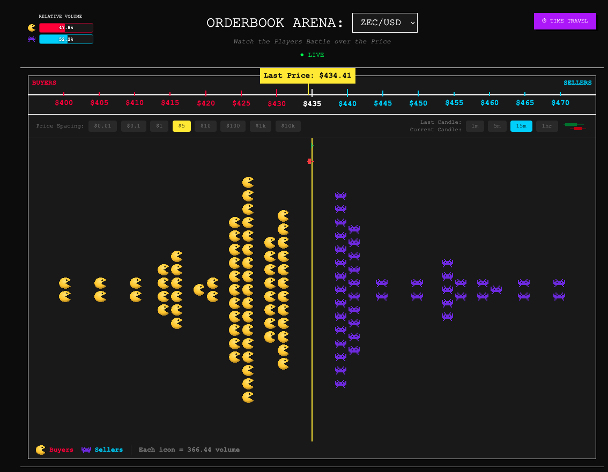

# Orderbook Visualizer

A real-time cryptocurrency orderbook visualizer with time-travel functionality. Watch buyers and sellers battle for price supremacy in an intuitive, gamified interface.



## 🎯 Overview

Traditional orderbook displays are intimidating walls of numbers. This visualizer transforms market data into an intuitive battle scene where:

- **Sellers** (blue team - Space Invaders) line up on the right from the current price
- **Buyers** (red team - Pacman) line up on the left from the current price
- **The centerline** represents the current price

**Time Travel**: Scrub through history to see how the battle unfolded during pumps, dumps, and sideways chop.


## ✨ Features

### Core (MVP)
- Real-time orderbook streaming from Kraken WebSocket API
- Icon visualization (crowd size = order volume)
- Interactive time-travel with play/pause/speed controls
- Dynamic centerline tracking last traded price
- Multiple trading pairs

## 🏗️ Architecture

```
┌─────────────────────────────────────────────────────────┐
│                     React Frontend                       │
│  ┌────────────────┐  ┌──────────────┐  ┌─────────────┐ │
│  │ Orderbook View │  │ Time Slider  │  │  Controls   │ │
│  └────────────────┘  └──────────────┘  └─────────────┘ │
└─────────────────────────────────────────────────────────┘
                            ▲
                            │ WebSocket / REST
                            ▼
┌─────────────────────────────────────────────────────────┐
│                      Rust Backend                        │
│  ┌──────────────┐  ┌──────────────┐  ┌──────────────┐  │
│  │   Kraken WS  │→ │  Orderbook   │→ │   Snapshot   │  │
│  │   Consumer   │  │    Engine    │  │    Store     │  │
│  └──────────────┘  └──────────────┘  └──────────────┘  │
│                                                          │
│  ┌──────────────┐  ┌──────────────┐                    │
│  │   REST API   │  │  WebSocket   │                    │
│  │   (History)  │  │  (Live Feed) │                    │
│  └──────────────┘  └──────────────┘                    │
└─────────────────────────────────────────────────────────┘
                            ▲
                            │
                            ▼
                    Kraken Exchange API
```

## 🚀 Tech Stack

### Backend
- **Rust** - Performance and safety for high-frequency data
- **tokio** - Async runtime
- **tokio-tungstenite** - WebSocket client
- **axum** - Web framework
- **serde** - JSON serialization

### Frontend  
- **React** - UI framework
- **framer-motion** - Smooth animations
- **recharts** - Optional charting
- **TailwindCSS** - Styling

## 📦 Project Structure

```
orderbook-visualizer/
├── backend/
│   ├── src/
│   │   ├── main.rs              # Entry point
│   │   ├── kraken/
│   │   │   ├── client.rs        # WebSocket connection
│   │   │   └── types.rs         # Message types
│   │   ├── orderbook/
│   │   │   ├── engine.rs        # State management
│   │   │   └── snapshot.rs      # History storage
│   │   └── api/
│   │       ├── routes.rs        # REST endpoints
│   │       └── websocket.rs     # Live feed
│   ├── Cargo.toml
│   └── README.md
│
├── frontend/
│   ├── src/
│   │   ├── components/
│   │   │   ├── OrderbookView.jsx
│   │   │   ├── PriceColumn.jsx
│   │   │   ├── TimeSlider.jsx
│   │   │   └── Controls.jsx
│   │   ├── hooks/
│   │   │   ├── useWebSocket.js
│   │   │   └── useTimeTravel.js
│   │   ├── App.jsx
│   │   └── main.jsx
│   ├── package.json
│   └── README.md
│
└── README.md (this file)
```

## 🛠️ Setup & Installation

### Prerequisites
- **Rust** 1.70+ ([install](https://rustup.rs/))
- **Node.js** 18+ ([install](https://nodejs.org/))

### Installation

```bash
# Install frontend dependencies
cd frontend
npm install
cd ..

# Launch both backend and frontend
./launch.sh
```

The app will be available at:
- **Frontend:** http://localhost:5173
- **Backend:** http://localhost:8080

Press `Ctrl+C` to stop both services.

## Notes

Built by Mylo Bennett aka Ready Mouse for Kraken Forge Hackathon Dec 2025
