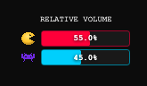
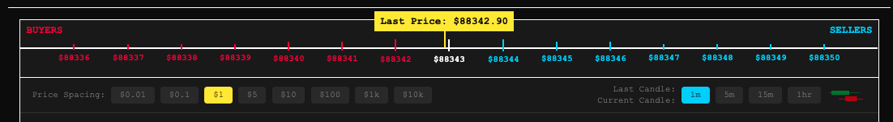
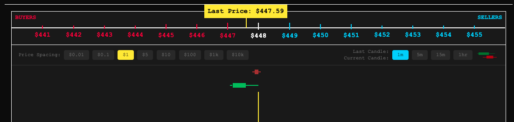
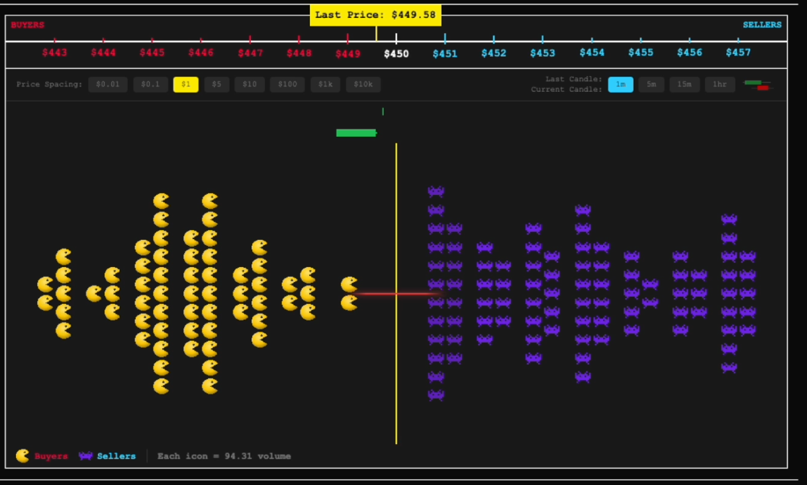
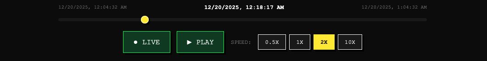
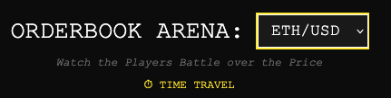
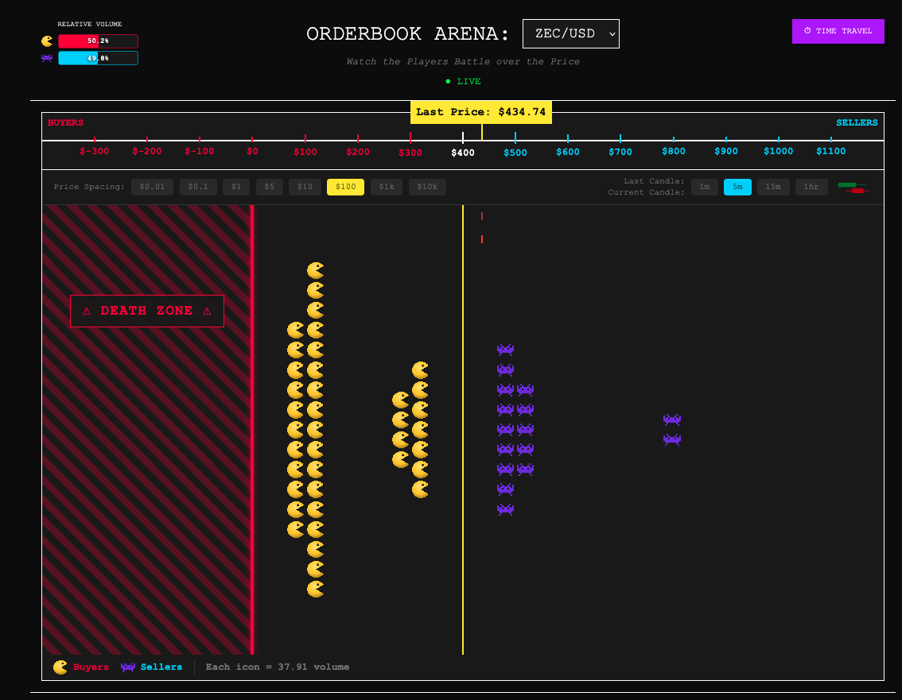

# Orderbook Arena
*Watch the Players Battle over the Price*


A real-time cryptocurrency orderbook visualizer with time-travel functionality. Watch buyers and sellers battle for price supremacy in an intuitive, gamified interface.


## 🎯 Overview

Traditional orderbook displays are intimidating walls of numbers. This visualizer transforms market data into an intuitive battle scene where:

- **Sellers** (blue team - Space Invaders) line up on the right from the current price
- **Buyers** (red team - Pacman) line up on the left from the current price
- **The centerline** represents the current price

**Time Travel**: Scrub through history to see how the battle unfolded during pumps, dumps, and sideways chop.

**Demo Video**: [Watch on YouTube](https://youtu.be/C68x4GK2k-I)

## ✨ Features

### Core (MVP)
- Real-time orderbook streaming from Kraken WebSocket API
- Icon visualization (crowd size = order volume)
- Interactive time-travel with play/pause/speed controls
- Dynamic centerline tracking last traded price
- Multiple trading pairs

### Bid-Ask Relative Volume 

In the upper-right hand corner of the screen, there are 2 battery life meters for the Buyer and Sellers that indicate the bid-ask proportions of the total volume.



### The Price Scale and Candles

The grid lines of the area can be changed to reflect different price spacing. This can be set in the upper control panels. There are also two horizontal candles that show open, close, high, and low prices for the given time interval set on the control panel. There are two stacked candles, the top is the last closed candle and the bottom is the current candle. 



Here you can see the top red candle is the closed candle, and the green candle is the active candle. 



### Lazers! 

The arena centerline is set at the start to the current price, when the price changes such that it croses the next tick mark on either side the grid, it triggers an adjustment. Based on which side put pressure to move the price, that side will fire lazers across to the other side. This is a visual indicator that the centerline price is shifting, and that one side is really pushing the price. 



### Time Travel 

There is the option for both live and time-travel viewing using the time indicator at the bottom of the screen. It has rewind, pause, play, and LIVE button as well as speed of playback. 



### Multiple Pairs 

The demo was recorded with ZEC, but other pairs are available using the dropdown menu at the top of the Orderbook Arena. 



### Below Zero Dollar DEATH ZONE 



## 🏗️ Architecture

```
┌─────────────────────────────────────────────────────────┐
│                     React Frontend                       │
│  ┌────────────────┐  ┌──────────────┐  ┌─────────────┐ │
│  │ Orderbook View │  │ Time Slider  │  │  Controls   │ │
│  └────────────────┘  └──────────────┘  └─────────────┘ │
└─────────────────────────────────────────────────────────┘
                            ▲
                            │ WebSocket / REST
                            ▼
┌─────────────────────────────────────────────────────────┐
│                      Rust Backend                        │
│  ┌──────────────┐  ┌──────────────┐  ┌──────────────┐  │
│  │   Kraken WS  │→ │  Orderbook   │→ │   Snapshot   │  │
│  │   Consumer   │  │    Engine    │  │    Store     │  │
│  └──────────────┘  └──────────────┘  └──────────────┘  │
│                                                          │
│  ┌──────────────┐  ┌──────────────┐                    │
│  │   REST API   │  │  WebSocket   │                    │
│  │   (History)  │  │  (Live Feed) │                    │
│  └──────────────┘  └──────────────┘                    │
└─────────────────────────────────────────────────────────┘
                            ▲
                            │
                            ▼
                    Kraken Exchange API
```

## 🚀 Tech Stack

### Backend
- **Rust** - Performance and safety for high-frequency data
- **tokio** - Async runtime
- **tokio-tungstenite** - WebSocket client
- **axum** - Web framework
- **serde** - JSON serialization

### Frontend  
- **React** - UI framework
- **framer-motion** - Smooth animations
- **recharts** - Optional charting
- **TailwindCSS** - Styling

## 📦 Project Structure

```
orderbook-visualizer/
├── backend/
│   ├── src/
│   │   ├── main.rs              # Entry point
│   │   ├── kraken/
│   │   │   ├── client.rs        # WebSocket connection
│   │   │   └── types.rs         # Message types
│   │   ├── orderbook/
│   │   │   ├── engine.rs        # State management
│   │   │   └── snapshot.rs      # History storage
│   │   └── api/
│   │       ├── routes.rs        # REST endpoints
│   │       └── websocket.rs     # Live feed
│   ├── Cargo.toml
│   └── README.md
│
├── frontend/
│   ├── src/
│   │   ├── components/
│   │   │   ├── OrderbookView.jsx
│   │   │   ├── PriceColumn.jsx
│   │   │   ├── TimeSlider.jsx
│   │   │   └── Controls.jsx
│   │   ├── hooks/
│   │   │   ├── useWebSocket.js
│   │   │   └── useTimeTravel.js
│   │   ├── App.jsx
│   │   └── main.jsx
│   ├── package.json
│   └── README.md
│
└── README.md (this file)
```

## 🛠️ Setup & Installation

### Prerequisites
- **Rust** 1.70+ ([install](https://rustup.rs/))
- **Node.js** 18+ ([install](https://nodejs.org/))

### Installation

```bash
# Install frontend dependencies
cd frontend
npm install
cd ..

# Launch both backend and frontend
./launch.sh
```

The app will be available at:
- **Frontend:** http://localhost:5173
- **Backend:** http://localhost:8080

Press `Ctrl+C` to stop both services.

## Notes

Built by Mylo Bennett aka Ready Mouse for Kraken Forge Hackathon Dec 2025
